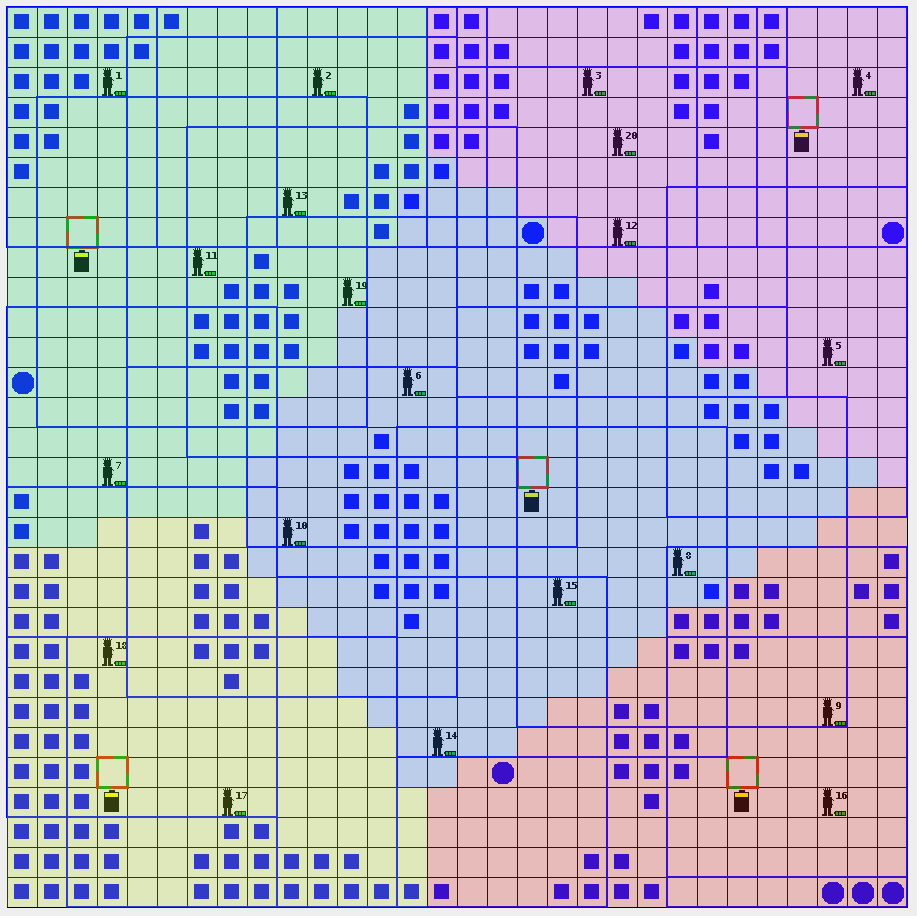
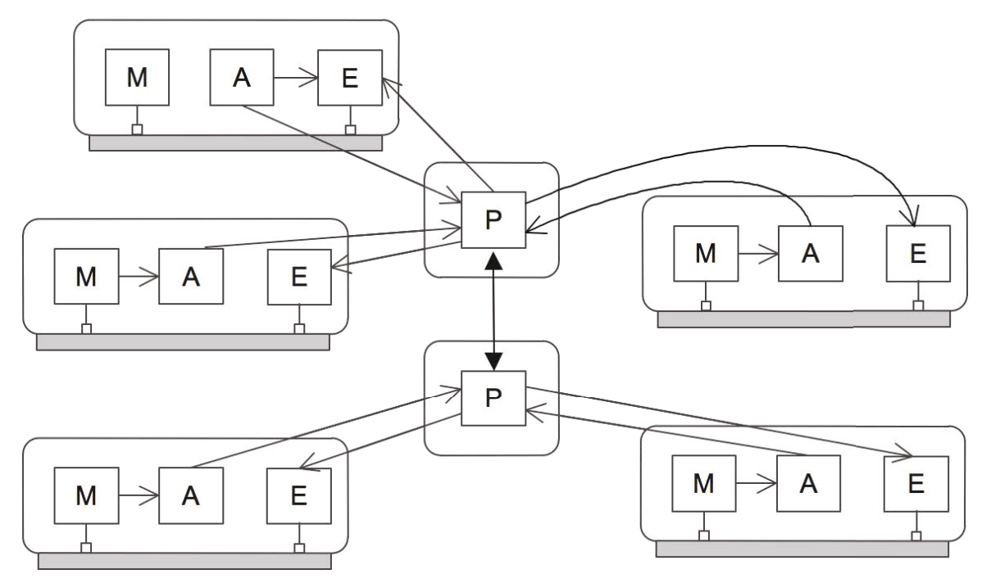

In this bachelor's thesis (submitted for the bachelor of informatics), I researched how different control mechanisms compare for coordinating multi-agent systems. For this, I used the [packetworld simulator](https://github.com/PacketWorld/PacketWorld) and I researched fully centralized, semi-centralized and fully decentralized architectures.
- skills: Research, Java, Integration with Existing Codebase
- status: Completed (Summer 2022)

## Details

To compare how you can ensure coordination in multi-agent systems, we used the [packetworld simulator](https://github.com/PacketWorld/PacketWorld). In this simulator (developped by the KULeuven), agents to perform certain tasks (such as bringing packets to their destination), but have a need to coordinate themselves, since they lose energy with each action they take. This coordination is needed since there is only a limited number of charging stations in the map, and if agents are uncoordinated, long waiting queues happen, which reduce the efficiency of the system (less agents working means less packets cleaned), and in the worst case, agents "die" when their energy reaches zero.

We coordinated agents using a [MAPE feedback-loop](https://en.wikipedia.org/wiki/Autonomic_computing), which is a software layer added on top of the logic of each agent to ensure coordination (using a Monitor component, Analyze component, Plan component and Execute component). 
There is a lot of freedom in instantiating MAPE patterns, and we analyzed three archetypes of patterns (going from fully centralized to fully decentralized).

As an example, below is an instantiation of the semi-centralized architecture (the regional planner pattern).

    
    

